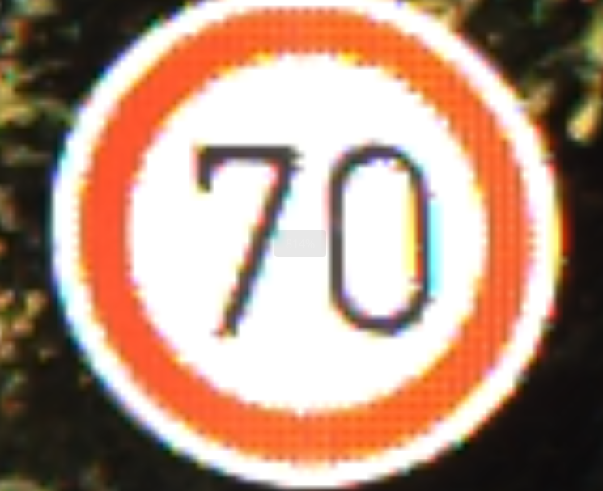
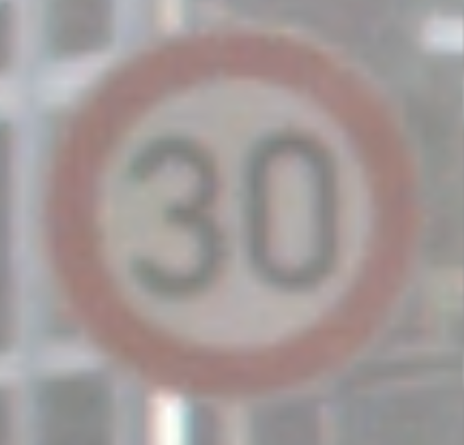

#交通标志分类\
##本项目基于深度学习的交通标志分类，模型需要根据输入图像准确预测其所属的交通标志类别
本项目使用 Python 和深度学习框架 PyTorch。目标是实现一个交通标志分类模型，该模型能够根据输入的图像准确预测其所属的交通标志类别。\
###数据来源：[GTSRB 官方数据集下载](https://benchmark.ini.rub.de/gtsrb_dataset.html)\
示例图片：

